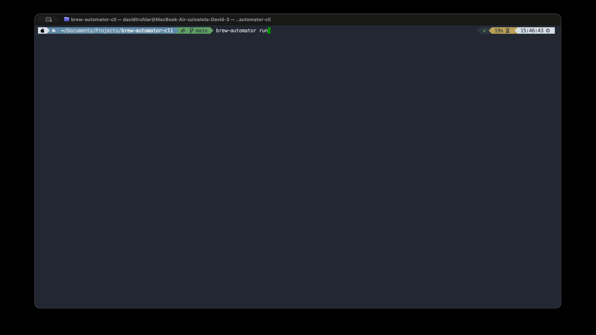

# brew-automator

[](https://github.com/xtruhlar/brew-automator/actions/workflows/ci.yml)
[](LICENSE)

A CLI tool for automated Homebrew maintenance (`update`, `outdated`, `upgrade`, `cleanup`, `doctor`, `missing`) that sends a report after every run — by email via SMTP and/or to a webhook (ntfy, Slack, Discord or any JSON endpoint) — plus a local macOS notification. The subject line differs depending on whether everything is OK or a problem was found. Covers both formulae and casks, and keeps a history of every run.


## Requirements

- macOS (uses `launchd` for scheduling and `osascript` for notifications)
- Python 3.9+ (standard library only, no external dependencies)
- [Homebrew](https://brew.sh)
- An SMTP account and/or a webhook to send reports to — optional, see [Setup](#setup)

## Installation

```
brew tap xtruhlar/brew-automator
brew install brew-automator
```

Requires Python 3 (no external dependencies, standard library only).

Alternatively, run it directly from the repo without installing:

```
./bin/brew-automator init
```

## Setup

```
brew-automator init
```

Interactively asks where reports should go and stores the answers in `~/.config/brew-automator/config.env` (chmod 600). This file is never published or committed — it lives outside the repository. You can enable either channel, or both:

- **Email (SMTP)** — host, port, user, password, destination address. The full report is the email body.
- **Webhook** — a URL plus its type. The short summary (see [Report](#report)) is sent:

  | `WEBHOOK_TYPE` | What is sent |
  |---|---|
  | `ntfy` | plain-text POST to your [ntfy](https://ntfy.sh) topic URL; problems get high priority and a ⚠️ tag |
  | `slack` | Slack incoming-webhook `{"text": ...}` |
  | `discord` | Discord webhook `{"content": ...}` (trimmed to Discord's 2000-char limit) |
  | `json` | `{"title", "status": "ok"/"problem", "summary", "report"}` — for your own endpoint |

  The type is inferred from the URL when you leave it blank. ntfy is the quickest way to get push notifications on your phone without an SMTP account.

See [config.env.example](config.env.example) for the file format if you'd rather write it by hand.

This step is optional. Without it, `brew-automator run` still runs the full maintenance routine and shows a macOS notification — it just skips sending (and says so).

## Running manually

```
brew-automator run                # full maintenance
brew-automator run --no-upgrade   # check and report as usual, but don't upgrade or clean up anything
brew-automator run --dry-run      # show what would be upgraded/cleaned up; sends nothing, records nothing
```

(or `./bin/brew-automator run` if running from the repo instead of a Homebrew install)

`--dry-run` uses `brew upgrade --dry-run` / `brew cleanup --dry-run`, prints the report and
exits — no notifications, no report file, no history entry. The only thing it changes is
`brew update` refreshing Homebrew's own package index. `--no-upgrade` is a normal run
(report, notifications, history) that simply skips the upgrade and cleanup steps; the
subject line is marked `(report only)`.

The report is written to `~/.config/brew-automator/report.txt`, and the run log to `~/.config/brew-automator/logs/brew-maintenance.log`.



## Report

Every report starts with a summary, followed by the raw output of each brew step:

```
== Summary ==
Status: PROBLEM
Upgraded (2): git (2.40 -> 2.50), firefox (130.0 -> 131.0)
Failed (1): node (20.1 -> 21.0)
Skipped (1): python@3.11 (excluded)
Freed by cleanup: 512.3MB
brew doctor: OK
brew missing: OK
Duration: 143s
```

A run counts as a problem when `brew doctor` fails, `brew missing` reports something, or
an upgrade fails — either `brew upgrade` exits non-zero, or a package it tried to upgrade
is still outdated afterwards. Pinned formulae (`brew pin`) are listed as skipped rather
than attempted.

## History and status

```
brew-automator history              # last 10 runs, newest first
brew-automator history -n 0         # all runs
brew-automator history -p node      # only runs that upgraded, failed or skipped node
brew-automator status               # last run, schedule + next run, channels, excluded packages
```

Every `run` (except `--dry-run`) appends one line to `~/.config/brew-automator/history.jsonl`
with what was upgraded (with versions), what failed or was skipped, the doctor/missing
result, freed space and duration. Handy for answering "when did this package change?"
after something breaks. The file is capped at the last 1000 runs.

## Scheduled runs (launchd)

```
brew-automator schedule install
```

Interactively pick one or more weekdays and times, then it generates and loads a launchd
LaunchAgent (`~/Library/LaunchAgents/com.brewautomator.maintenance.plist`) that runs
`brew-automator run` on that schedule. Re-running `install` replaces the existing schedule.

```
brew-automator schedule status   # check whether it's installed and loaded
brew-automator schedule remove   # unload and delete it
```

Under the hood this handles the two gotchas that otherwise bite you with a hand-written
plist: pointing `ProgramArguments` at the actual installed binary, and setting `PATH` in
`EnvironmentVariables` (launchd's default `PATH` doesn't include Homebrew's bin
directories, which breaks `brew` discovery and makes `brew doctor` report bogus PATH
warnings).

You can still trigger a scheduled run manually without waiting for its time:
```
launchctl start com.brewautomator.maintenance
```

## Formulae and casks

`brew upgrade` and `brew cleanup` already cover both formulae and installed casks by
default, so both get upgraded and cleaned up in every run. The report shows outdated
formulae and outdated casks in separate sections; the cask check uses `--greedy-latest`,
since casks pinned to a version like `latest` otherwise never get flagged as outdated even
when a newer release exists. This deliberately skips `auto_updates`-true casks (browsers
and similar apps that update themselves) — brew isn't managing those, so flagging them
would just be noise.

## Excluding formulae/casks from upgrades

```
brew-automator settings
```

Interactively lists every installed formula and cask (↑/↓ to move, space to toggle, enter
to save). Anything you select is excluded from `brew upgrade` on future `run`s — it still
shows up in the outdated section of the report so you know it's out of date, it just won't
get auto-upgraded. Useful for pinning something you're intentionally holding back.

The exclusion list is stored in `~/.config/brew-automator/ignored.json`.


## Logs

- `~/.config/brew-automator/logs/brew-maintenance.log` — per-run progress log (internal logging)
- `~/.config/brew-automator/logs/launchd.out.log` / `launchd.err.log` — launchd stdout/stderr (e.g. startup errors)
- `~/.config/brew-automator/report.txt` — the most recently generated report
- `~/.config/brew-automator/history.jsonl` — one JSON line per run (see [History and status](#history-and-status))
- `~/.config/brew-automator/state.json` — signature of the last reported warning (see below)

## Releasing

```
scripts/release.sh 0.9.0 ["short summary of what's in this release"]
```

Bumps `__version__`, commits, tags, pushes, and publishes a GitHub release in one step —
version is never hand-edited separately from the tag. The optional summary is prepended
above the auto-generated commit changelog in the release notes, so the release is clear
at a glance instead of just a raw commit list. The Homebrew tap formula then updates
itself automatically via [.github/workflows/bump-homebrew-formula.yml](.github/workflows/bump-homebrew-formula.yml).

## Development

```
python3 -m unittest discover -s tests -v
```

Tests run in CI on every push/PR via GitHub Actions ([.github/workflows/ci.yml](.github/workflows/ci.yml)).

## Warning deduplication

Every run sends a `🍺 Homebrew OK` report when there's no problem, so you always know the
job actually ran. When `brew doctor`, `brew missing` or a failed upgrade reports a problem,
the warning content (plus the names of failed packages) is hashed and compared against
`state.json`. If it's the same problem as last time, the `⚠️ Homebrew Warning` email and
webhook are skipped (logged instead) so you don't get re-alerted for something you're
already aware of — a *new or changed* warning still notifies you. If sending to any
channel fails, the warning isn't remembered, so it's retried on the next run.
